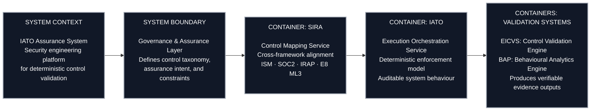
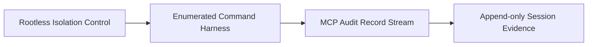
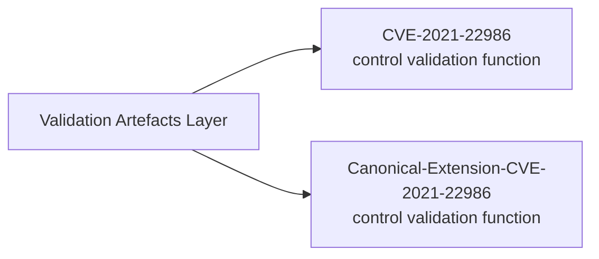
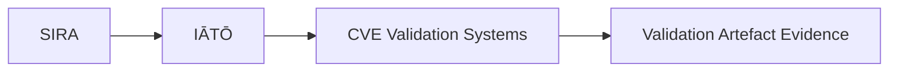
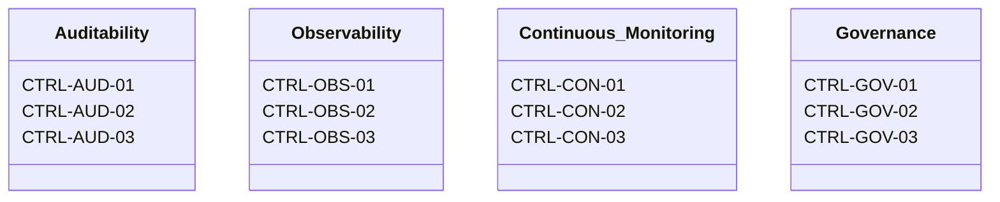

**Name:** Dhruv Setty
**Role:** Security Engineer (DevSecOps / AppSec)


---

## System Overview


The IATO system is an **assurance programme** defined at the **C4 System Context level** as a bounded, parameterised security engineering platform responsible for deterministic control validation and evidence production. The system is instantiated as a configured execution of this programme, where all behaviour is derived from explicitly declared parameters, constants, and stubbed inputs. It does not function as a monitoring or advisory capability; it is a formal assurance mechanism that evaluates, maps, and records control behaviour against a defined and auditable baseline.

Within the **system boundary**, the programme comprises a set of cooperating **containers**, each with a strictly defined responsibility in the assurance lifecycle. The Governance and Assurance container defines system-wide constraints, control taxonomy, and execution invariants. The SIRA container operates as a control mapping service, parameterising control definitions and aligning them across external frameworks such as ISM, ASD Essential Eight ML3, SOC 2, and ISO/IEC 27001. The IATO container functions as the execution orchestration service, enforcing deterministic processing semantics and ensuring that all system behaviour is derived from declared inputs with no implicit execution paths.

All execution is performed against **stubbed, version-controlled inputs**, including fixed test vectors, pre-staged datasets, and declared configuration constants. These inputs define each system instance and ensure that execution is reproducible and bounded. The system explicitly prohibits dynamic code execution and runtime interpretation mechanisms, including but not limited to the use of `eval()`, `exec()`, dynamic deserialisation into executable objects, or equivalent constructs. Environment variables are not used to influence control logic, execution paths, or model behaviour; all operational parameters are defined as immutable, module-level constants at load time. System behaviour is independent of **wall-clock time**; no control evaluation, model output, or decision path may depend on current timestamps, system time drift, or temporal side effects outside of explicitly declared and versioned inputs.

The system further enforces strict input handling guarantees. All ingested data is treated as untrusted and processed through typed, schema-bound interfaces. No input is executed, interpolated into command contexts, or passed to interpreters. Classes of vulnerabilities such as **SQL injection, command injection, deserialisation exploits, and arbitrary code execution** are structurally precluded by design through the absence of dynamic execution paths, strict type enforcement, and prohibition of runtime evaluation mechanisms.

Validation containers, including control validation engines and behavioural analytics pipelines, consume these parameterised inputs and produce artefacts such as cryptographically verifiable evidence records, control trace matrices, and governance outputs. No container performs undeclared external calls, accesses runtime network resources, or mutates input state. All data flows are explicitly defined and unidirectional, and all outputs are written within bounded filesystem scopes.

From a C4 perspective, the system enforces strict **container isolation, deterministic execution, and reproducibility guarantees**. Each container processes only declared inputs and produces outputs that are fully attributable to those inputs and the governing control mappings. Identical system instances, when executed with identical inputs and constants, produce identical outputs. This design ensures that the system is fully auditable, reproducible, and suitable for formal assurance processes, including independent assessment and regulatory submission.


---

## Programmes

### SIRA — Stochastic-Invalidation-Risk-Architecture

- **Purpose:** Maps risk governance controls to auditable validation boundaries.


- **Linked repositories:**
  - [`Stochastic-Invalidation-Risk-Architecture`](https://github.com/whatheheckisthis/Stochastic-Invalidation-Risk-Architecture)
- **Control frameworks referenced:**
  - ISM Application Control
  - ASD Essential Eight ML3
  - SOC 2 CC7.2
  - ISO/IEC 27001

### IĀTŌ — Intent-to-Auditable-Trust-Object

- **Purpose:** Enforces privileged-access elimination and auditable container execution semantics.



- **Linked repositories:**
  - [`Intent-to-Auditable-Trust-Object-Index`](https://github.com/whatheheckisthis/Intent-to-Auditable-Trust-Object-Index)
- **Control frameworks referenced:**
  - ISM Application Control
  - ASD Essential Eight ML3
  - SOC 2 CC7.2
  - ISO/IEC 27001

---

## Validation Artefacts 

### CVE Validation Subsystem



- [`CVE-2021-22986`](https://github.com/whatheheckisthis/CVE-2021-22986)
- [`Canonical-Extension-CVE-2021-22986`](https://github.com/whatheheckisthis/Canonical-Extension-CVE-2021-22986)



---

## Practice Framework

| Registry Item | Source | Governance Mapping |
|---|---|---|
| ETHOS.md | [`docs/ETHOS.md`](https://github.com/whatheheckisthis/Stochastic-Invalidation-Risk-Architecture/blob/main/docs/ETHOS.md) | Architecture philosophy and stack governance |
| DELIVERY.md | [`docs/DELIVERY.md`](https://github.com/whatheheckisthis/Stochastic-Invalidation-Risk-Architecture/blob/main/docs/DELIVERY.md) | Engagement execution model and GRC control mapping |

---

## Delivery Model 


---

## Controls Taxonomy 



| Control Group | Control IDs | Mapping Context |
|---|---|---|
| Auditability | CTRL-AUD-01 · CTRL-AUD-02 · CTRL-AUD-03 | ISM · SOC 2 · ASD Essential Eight ML3 |
| Observability | CTRL-OBS-01 · CTRL-OBS-02 · CTRL-OBS-03 | ISM · SOC 2 · ASD Essential Eight ML3 |
| Continuous Monitoring | CTRL-CON-01 · CTRL-CON-02 · CTRL-CON-03 | ISM · SOC 2 · ASD Essential Eight ML3 |
| Governance | CTRL-GOV-01 · CTRL-GOV-02 · CTRL-GOV-03 | ISM · SOC 2 · ASD Essential Eight ML3 |

---

## Commercial Model

| Parameter | Specification |
|---|---|
| Day rate | Market-aligned contractor rate (DevSecOps / GRC uplift scope) |
| Engagement model | Fixed-term DevSecOps uplift (typically 100–120 days) |
| Delivery cadence | Capacity-based engagements (~2 per annum) |
| Billing terms | Milestone-based or fortnightly · Net 14 |
| Engagement channels | Specialist recruiters · direct referrals · GitHub |

---

`E8 ML3` · `ISM` · `IRAP` · `DISP` · `APRA CPS 220`

**Engagement enquiries:** Direct recruiter engagement preferred.

```text
itsdhruvsetty@gmail.com
```
