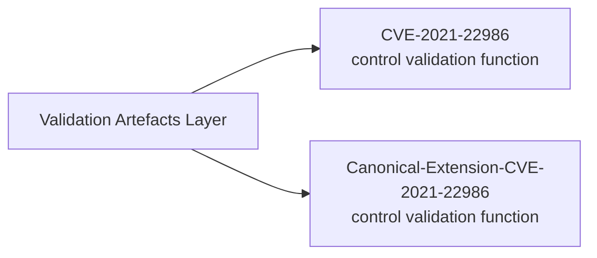
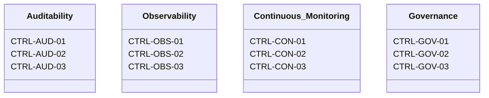

## Overview

The system is defined within the **IĀTŌ (Intent-to-Auditable-Trust-Object)** Assurance Programme, Instantiated as a runtime execution within a bounded, parameterised security engineering platform, serving as an environment to enable deterministic control validation and the production of verifiable evidence.


## Assurance Programmes

### SIRA — Stochastic-Invalidation-Risk-Architecture

- **Purpose:** MRM (Model Risk Management) artefact is a downstream construct for representing and evidencing model risk controls. 

  - [`Stochastic-Invalidation-Risk-Architecture`](https://github.com/whatheheckisthis/Stochastic-Invalidation-Risk-Architecture)
- **Control frameworks referenced:**
  - ISM Application Control
  - ASD Essential Eight ML3
  - SOC 2 CC7.2
  - ISO/IEC 27001

### IĀTŌ — Intent-to-Auditable-Trust-Object

- **Purpose:** Enforces privileged-access elimination and auditable container execution semantics.

  - [`Intent-to-Auditable-Trust-Object-Index`](https://github.com/whatheheckisthis/Intent-to-Auditable-Trust-Object-Index)
- **Control frameworks referenced:**
  - ISM Application Control
  - ASD Essential Eight ML3
  - SOC 2 CC7.2
  - ISO/IEC 27001


## Validation Artefacts 

### CVE Validation Subsystem



- [`CVE-2021-22986`](https://github.com/whatheheckisthis/CVE-2021-22986)
- [`Canonical-Extension-CVE-2021-22986`](https://github.com/whatheheckisthis/Canonical-Extension-CVE-2021-22986)


## Practice Framework

| Registry Item | Source | Governance Mapping |
|---|---|---|
| ETHOS.md | [`docs/ETHOS.md`](https://github.com/whatheheckisthis/Stochastic-Invalidation-Risk-Architecture/blob/main/docs/ETHOS.md) | Architecture philosophy and stack governance |
| DELIVERY.md | [`docs/DELIVERY.md`](https://github.com/whatheheckisthis/Stochastic-Invalidation-Risk-Architecture/blob/main/docs/DELIVERY.md) | Engagement execution model and GRC control mapping |


## Controls Taxonomy 



| Control Group | Control IDs | Mapping Context |
|---|---|---|
| Auditability | CTRL-AUD-01 · CTRL-AUD-02 · CTRL-AUD-03 | ISM · SOC 2 · ASD Essential Eight ML3 |
| Observability | CTRL-OBS-01 · CTRL-OBS-02 · CTRL-OBS-03 | ISM · SOC 2 · ASD Essential Eight ML3 |
| Continuous Monitoring | CTRL-CON-01 · CTRL-CON-02 · CTRL-CON-03 | ISM · SOC 2 · ASD Essential Eight ML3 |
| Governance | CTRL-GOV-01 · CTRL-GOV-02 · CTRL-GOV-03 | ISM · SOC 2 · ASD Essential Eight ML3 |

---

## Commercial Model

| Parameter | Specification |
|---|---|
| Day rate | Market-aligned contractor rate (DevSecOps / GRC uplift scope) |
| Engagement model | Fixed-term DevSecOps uplift (typically 100–120 days) |
| Delivery cadence | Capacity-based engagements (~2 per annum) |
| Billing terms | Milestone-based or fortnightly · Net 14 |
| Engagement channels | Specialist recruiters · direct referrals · GitHub |

---

`E8 ML3` · `ISM` · `IRAP` · `DISP` · `APRA CPS 220`

**Engagement enquiries:** Direct recruiter engagement preferred.

```text
itsdhruvsetty@gmail.com
```
