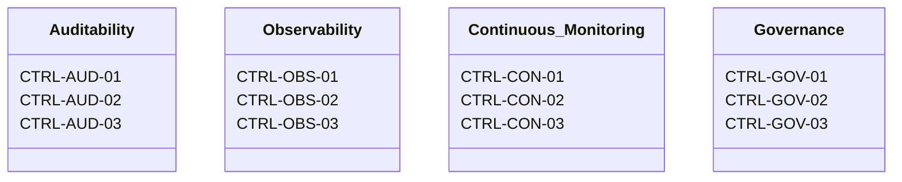

## Overview


| Attribute | Position |
|---|---|
| Engagement model | Fixed-term uplift contractor |
| Delivery posture | evidence-bound, schema-primary |
| Output orientation | Auditable target state — not advisory narrative |
| Evidence model | Append-only, hash-chained, timestamped |
| Policy instrument | Policy as Code (OPA / Conftest / Azure Policy / AWS IAM) |
| Automation posture | Closed-loop: control assertion → evidence emission → ledger commit |
| Frameworks | NZISM, E8 ML3, ISM, IRAP, DISP, APRA CPS 220 |
| Primary markets | Australian and New Zealand government and enterprise |


## Framework Adherence

### NZISM — New Zealand Information Security Manual

New Zealand Government Communications Security Bureau (GCSB) baseline. Applied to NZ Crown entity and government-adjacent engagements. Controls mapped at the classification level appropriate to the engagement scope (Unclassified through to Restricted). Implementation guidance cross-walked against ISM where Australian counterpart alignment is required.

Key focus areas: access control, cryptographic controls, system hardening, patch management, and security monitoring — all asserted as machine-verifiable control states where tooling permits.


### E8 ML3 — ASD Essential Eight Maturity Level 3

Highest mandatory Essential Eight maturity grade. ML3 is treated as the baseline floor for all AU government and regulated enterprise engagements — not a ceiling or aspirational target.

Control families covered across all eight strategies:

```
Application control          — allowlist enforcement, scope coverage, exception governance
Patch applications           — patch currency SLA, automated detection, gap evidence
Configure MS Office macros   — macro signing, sandbox enforcement, user override controls
User application hardening   — browser plugin governance, JScript/ActiveX control surface
Restrict admin privileges    — PAM coverage, standing access elimination, JIT attestation
Patch operating systems      — OS patch currency, EOL enforcement, unsupported asset register
MFA                          — phishing-resistant MFA, privileged and unprivileged coverage
Regular backups              — RTO/RPO-bound, restoration tested, integrity-chained
```

All eight strategies are asserted at ML3 against the ASD evidence requirements. Evidence is structured for direct IRAP assessor consumption.


### ISM — Australian Government Information Security Manual

ACSC published baseline for Australian government systems. Treated as the primary control reference for all AU-market engagements. ISM controls are mapped into the IĀTŌ controls index as enumerated, addressable assurance targets.

ISM revision currency is maintained. Controls are not treated as static checklists — each control is modelled as an observable state with a defined assertion mechanism and evidence artefact class.


### IRAP — Information Security Registered Assessors Program

IRAP alignment structures all AU government engagement deliverables for assessor review-readiness. This means:

- system security plans (SSP) formatted to IRAP expectations
- control implementation statements machine-generated from asserted control states
- evidence packages structured as append-only ledger extracts, not ad-hoc document collections
- residual risk statements tied to observable control gaps, not qualitative narrative

The practice does not hold IRAP assessor registration. IRAP-aligned deliverables are produced to support and accelerate registered assessor engagements, not to substitute for them.


### DISP — Defence Industry Security Program

Australian Defence Department supply chain security baseline. Applied where engagements involve defence industry clients or supply chain participants subject to DISP membership obligations.

DISP obligations covered:

```
Personnel security          — clearance currency, insider threat controls
Physical security           — asset classification, perimeter controls, clean desk
ICT security                — ISM-aligned, network segregation, removable media
Governance                  — security plan, incident reporting, annual review cadence
```

Evidence structures for DISP are consistent with those produced for ISM/IRAP — same ledger, same schema, different control crosswalk layer.


### APRA CPS 220 — Risk Management

Australian Prudential Regulation Authority standard for operational risk management in APRA-regulated entities (ADIs, insurers, RSE licensees). Applied to financial sector engagements.

CPS 220 alignment covers:

- operational risk framework adequacy — control surface modelling via SIRA
- material risk identification and treatment — stochastic risk register, quantified residual exposure
- business continuity and recovery — RTO/RPO control assertions, tested restoration evidence
- third-party and supply chain risk — vendor control attestation, dependency mapping
- board and senior management accountability structures — governance artefacts structured for prudential reviewer consumption

CPS 220 is treated as a risk governance overlay, not a technical control standard. SIRA outputs are the primary instrument for CPS 220 risk quantification deliverables.


## Crosswalk Model

All framework obligations are managed through a unified crosswalk layer. Controls are not maintained as per-framework silos — each control is a single enumerated entry in the IĀTŌ controls index, tagged with the framework identifiers it satisfies.

```
control_id: IATO-AC-012
title:      Privileged Access — Standing Access Elimination
assertion:  no standing privileged accounts outside defined break-glass scope
evidence:   IAM role inventory extract, last-reviewed timestamp, exception register
frameworks:
  - NZISM:       AC-7
  - ISM:         ISM-1175, ISM-1507
  - E8 ML3:      Restrict Administrative Privileges — ML3
  - DISP:        ICT-04
  - APRA CPS 220: ORM-3.2 (operational risk control)
```

This model eliminates duplicate evidence production across frameworks and provides a single auditable evidence trail regardless of which framework is the assurance target for a given engagement.


## Assurance Programmes
| Programme | Purpose | Control Frameworks |
|-----------|---------|-------------------|
| [`SIRA`](https://github.com/whatheheckisthis/Stochastic-Invalidation-Risk-Architecture) | MRM (Model Risk Management) artefact is a downstream construct for representing and evidencing model risk controls. | ISM Application Control · ASD Essential Eight ML3 · SOC 2 CC7.2 · ISO/IEC 27001 |
| [`IATO`](https://github.com/whatheheckisthis/Intent-to-Auditable-Trust-Object-Index)| Enforces privileged-access elimination and auditable container . | ISM Application Control · ASD Essential Eight ML3 · SOC 2 CC7.2 · ISO/IEC 27001 |


## Controls Taxonomy 



| Control Group | Control IDs | Mapping Context |
|---|---|---|
| Auditability | CTRL-AUD-01 · CTRL-AUD-02 · CTRL-AUD-03 | ISM · SOC 2 · ASD Essential Eight ML3 |
| Observability | CTRL-OBS-01 · CTRL-OBS-02 · CTRL-OBS-03 | ISM · SOC 2 · ASD Essential Eight ML3 |
| Continuous Monitoring | CTRL-CON-01 · CTRL-CON-02 · CTRL-CON-03 | ISM · SOC 2 · ASD Essential Eight ML3 |
| Governance | CTRL-GOV-01 · CTRL-GOV-02 · CTRL-GOV-03 | ISM · SOC 2 · ASD Essential Eight ML3 |


---

## Commercial Model

| Parameter | Specification |
|---|---|
| Day rate | Market-aligned contractor rate |
| Engagement model | Fixed-term (100–120 days) |
| Delivery cadence | Capacity based engagements (~2 per annum) |
| Billing terms | Milestone or fortnightly · Net 14 |
| Engagement channels | Specialist recruiters · direct referrals · GitHub |

`NZISM` · `E8 ML3` · `ISM` · `IRAP` · `DISP` · `APRA CPS 220`

**Engagement enquiries:** Direct recruiter engagement preferred.

```text
itsdhruvsetty@gmail.com
```
