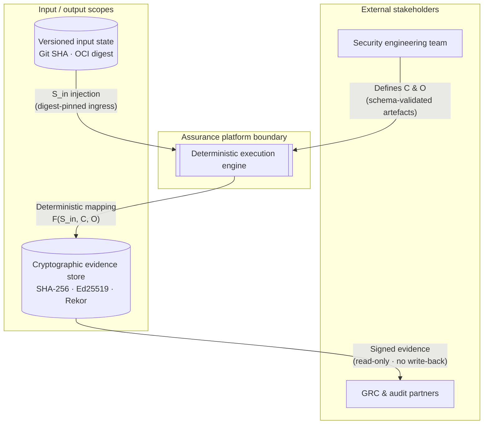
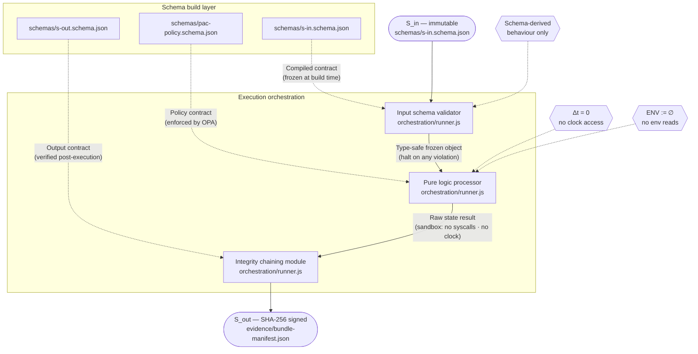
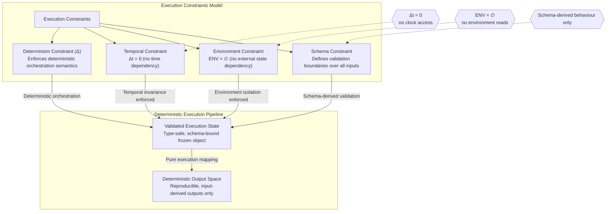
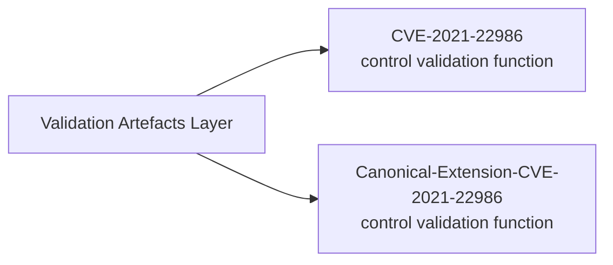
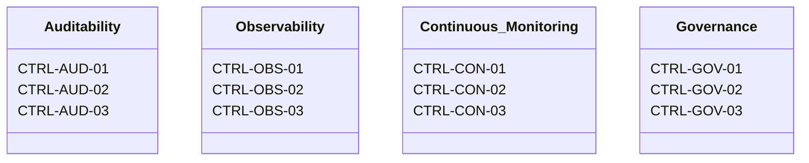

## Overview

The system is defined within the **IĀTŌ (Intent-to-Auditable-Trust-Object) Assurance Programme**, implemented as a bounded, parameterised security-engineering platform for deterministic control validation and evidence production.

It is instantiated as a runtime execution of declared configuration, constants, and stubbed inputs. All system behaviour is derived exclusively from these inputs.


## Architecture

The system is structured into three primary containers:

Defines control taxonomy, system constraints, and execution invariants.  
This layer acts as the policy and control authority for all system behaviour.


Performs cross-framework normalisation and alignment across:
- ISM (Australian Information Security Manual)
- ASD Essential Eight (ML3)
- SOC 2
- ISO/IEC 27001  

Ensures all controls are consistently interpreted and mapped across frameworks.

- Provides deterministic runtime coordination and enforces execution strictly from declared inputs.  
- This is the control execution plane of the system.


## Execution Model

Execution operates only on **stubbed, version-controlled inputs**, including fixed test vectors, datasets, and configuration constants.

These inputs fully determine each runtime instance. No external or implicit state is permitted to influence execution outcomes.

Dynamic execution is explicitly prohibited, including:
- `eval()`
- `exec()`
- runtime deserialisation into executable constructs
- equivalent runtime code generation or interpretation mechanisms

Environment variables do not influence control logic or execution paths.  
All configuration is resolved at initialisation from immutable constants.  
System behaviour is independent of **wall-clock time, timestamps, and runtime temporal state**.

All inputs are processed through typed, schema-bound interfaces and treated strictly as data.

This design structurally eliminates entire classes of runtime execution risk, including:

- SQL injection
- command injection
- deserialisation exploitation
- arbitrary code execution

This is achieved by removing runtime interpretation pathways entirely from the execution model.


## Validation Model

Validation and analytics containers generate structured outputs, including:
- control trace matrices
- cryptographically verifiable evidence records
- governance artefacts

All outputs are bound to declared filesystem scopes.  
No external communication or state mutation is permitted.


## Evidence Integrity Model

All evidence artefacts are cryptographically bound using **SHA-256 hashing**, with integrity chaining supported through **Ed25519 digital signatures**.

This provides:
- tamper-evident evidence generation
- verifiable provenance across all outputs
- end-to-end integrity tracking across system execution


## Execution Summary 
>The system enforces deterministic, boundary-constrained execution over versioned inputs to produce cryptographically verifiable evidence artefacts with no external state mutation or runtime variability beyond declared control mappings..





---



---


### Annotation 
>This system formalises execution as a deterministic state-transition function **∀ x ∈ 𝒱**, where outputs are fully derived from immutable input state, schema-bound control definitions, and orchestration rules.
Under the invariant set 𝒱, identical inputs and control mappings produce identical output states, ensuring zero stochastic variance, no runtime divergence, and no external state dependency.

Execution is constrained by:
- schema-derived validation boundaries
- environment and time independence (ENV = ∅, Δt = 0)
- deterministic processor semantics enforced at orchestration level

All outputs are bound as cryptographically signed evidence artefacts, preserving integrity and traceability across execution instances.


## Assurance Programmes

### SIRA — Stochastic-Invalidation-Risk-Architecture

- **Purpose:** MRM (Model Risk Management) artefact is a downstream construct for representing and evidencing model risk controls. 

  - [`Stochastic-Invalidation-Risk-Architecture`](https://github.com/whatheheckisthis/Stochastic-Invalidation-Risk-Architecture)
- **Control frameworks referenced:**
  - ISM Application Control
  - ASD Essential Eight ML3
  - SOC 2 CC7.2
  - ISO/IEC 27001

### IĀTŌ — Intent-to-Auditable-Trust-Object

- **Purpose:** Enforces privileged-access elimination and auditable container execution semantics.

  - [`Intent-to-Auditable-Trust-Object-Index`](https://github.com/whatheheckisthis/Intent-to-Auditable-Trust-Object-Index)
- **Control frameworks referenced:**
  - ISM Application Control
  - ASD Essential Eight ML3
  - SOC 2 CC7.2
  - ISO/IEC 27001


## Validation Artefacts 

### CVE Validation Subsystem



- [`CVE-2021-22986`](https://github.com/whatheheckisthis/CVE-2021-22986)
- [`Canonical-Extension-CVE-2021-22986`](https://github.com/whatheheckisthis/Canonical-Extension-CVE-2021-22986)


## Practice Framework

| Registry Item | Source | Governance Mapping |
|---|---|---|
| ETHOS.md | [`docs/ETHOS.md`](https://github.com/whatheheckisthis/Stochastic-Invalidation-Risk-Architecture/blob/main/docs/ETHOS.md) | Architecture philosophy and stack governance |
| DELIVERY.md | [`docs/DELIVERY.md`](https://github.com/whatheheckisthis/Stochastic-Invalidation-Risk-Architecture/blob/main/docs/DELIVERY.md) | Engagement execution model and GRC control mapping |


## Controls Taxonomy 



| Control Group | Control IDs | Mapping Context |
|---|---|---|
| Auditability | CTRL-AUD-01 · CTRL-AUD-02 · CTRL-AUD-03 | ISM · SOC 2 · ASD Essential Eight ML3 |
| Observability | CTRL-OBS-01 · CTRL-OBS-02 · CTRL-OBS-03 | ISM · SOC 2 · ASD Essential Eight ML3 |
| Continuous Monitoring | CTRL-CON-01 · CTRL-CON-02 · CTRL-CON-03 | ISM · SOC 2 · ASD Essential Eight ML3 |
| Governance | CTRL-GOV-01 · CTRL-GOV-02 · CTRL-GOV-03 | ISM · SOC 2 · ASD Essential Eight ML3 |

---

## Commercial Model

| Parameter | Specification |
|---|---|
| Day rate | Market-aligned contractor rate (DevSecOps / GRC uplift scope) |
| Engagement model | Fixed-term DevSecOps uplift (typically 100–120 days) |
| Delivery cadence | Capacity-based engagements (~2 per annum) |
| Billing terms | Milestone-based or fortnightly · Net 14 |
| Engagement channels | Specialist recruiters · direct referrals · GitHub |

---

`E8 ML3` · `ISM` · `IRAP` · `DISP` · `APRA CPS 220`

**Engagement enquiries:** Direct recruiter engagement preferred.

```text
itsdhruvsetty@gmail.com
```
