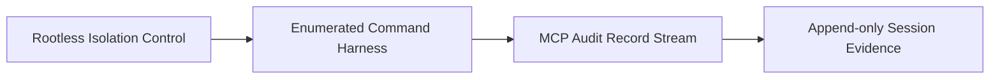
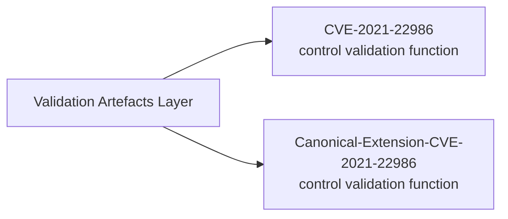
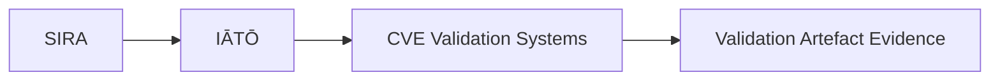
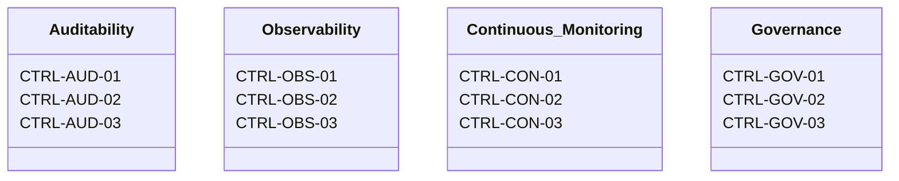

## Overview

The system is defined as an **assurance programme (system context model)** implemented as a bounded, parameterised security engineering platform for deterministic control validation and evidence production. 

Instantiated as a runtime execution of declared configuration, constants, and stubbed inputs. All behaviour is derived exclusively from these inputs.

The system is structured into three primary containers:

* Governance and Assurance container defines control taxonomy, system constraints, and execution invariants (policy and control authority layer).
* Control Mapping container performs cross-framework alignment across ISM, ASD Essential Eight ML3, SOC 2, and ISO/IEC 27001 (normalisation layer).
* Execution Orchestration container provides deterministic runtime coordination and enforces execution strictly from declared inputs (control execution plane).

Execution operates only on **stubbed, version-controlled inputs**, including fixed test vectors, datasets, and configuration constants. These inputs fully determine each runtime instance.

* Dynamic execution is prohibited, including `eval()`, `exec()`, runtime deserialisation into executable constructs, and equivalent mechanisms. Environment variables do not influence control logic or execution paths. All configuration is resolved at initialisation from immutable constants. System behaviour is independent of **wall-clock time**, timestamps, and runtime temporal state.

* Inputs are processed through typed, schema-bound interfaces and treated strictly as data. This structurally eliminates **SQL injection, command injection, deserialisation exploitation, and arbitrary code execution** by removing runtime interpretation pathways.

* Validation and analytics containers generate structured outputs including control trace matrices, cryptographically verifiable evidence records, and governance artefacts. All outputs are bound to declared filesystem scopes. No external communication or state mutation is permitted.

>All evidence artefacts are cryptographically bound using SHA-256 hashing, with integrity chaining supported through digital signatures (Ed25519), tamper-evident, verifiable provenance across all generated outputs.


## Execution Summary

| Domain          | Constraint                      | Stub / Value Model                                          |
| --------------- | ------------------------------- | ----------------------------------------------------------- |
| Inputs          | Immutable per runtime instance  | `S₁ → Sₙ` (fixed test vectors, versioned datasets)          |
| Configuration   | Static initialisation only      | `C₀` (module-level constants, frozen at load time)          |
| Execution       | Deterministic, parameter-driven | `Σ(f(x)) → y` (no runtime branching outside declared logic) |
| Control Flow    | Explicit declaration only       | `→` directed graph only (no implicit transitions)           |
| Code Evaluation | Prohibited dynamic execution    | `✕ eval() / exec() / reflection / deserialisation`          |
| Environment     | Non-influential state           | `ENV = ∅` (no environment variable dependency)              |
| Time Model      | Non-temporal execution          | `T₀ ≠ runtime dependency` (no wall-clock coupling)          |
| Data Handling   | Typed, schema-bound only        | `D(type-safe JSON / schema objects)`                        |
| Outputs         | Structured and bounded          | `O₁ → Oₙ` (filesystem-scoped artefacts only)                |
| Side Effects    | Disallowed                      | `Δstate = 0` outside declared outputs                       |

---

| Domain            | Constraint                                                       |
| ----------------- | ---------------------------------------------------------------- |
| Input Model       | ∀ inputs ∈ {stubbed, version-controlled, immutable per instance} |
| Execution         | Deterministic, parameter-driven only                             |
| Control Flow      | Strict linear sequence (01 → 05)                                 |
| Environment       | ENV := ∅ (no environment-variable influence permitted)           |
| Time Dependency   | Δt = 0 (no wall-clock coupling)                                  |
| Dynamic Execution | ⊘ eval(), ⊘ exec(), ⊘ reflection, ⊘ runtime deserialisation      |
| Side Effects      | Bounded strictly to declared output layer                        |
| Reproducibility   | ∀ runs: identical inputs ⇒ identical outputs                     |


>The system is defined as an exec env with strict separation of `inputs`, `ctrl` mapping, orchestration, and outputs, enforcing reproducible behaviour across equivalent runtime `instances` and system `instantiations`. It guarantees invariant execution semantics by eliminating variance introduced by race conds, fp drift, and execution divergence across matching inst states and `state trans`. Each run follows a closed mapping of **inputs → control flow → orchestration → outputs**, ensuring deterministic equivalence under identical conditions.


| Domain                | Constraint                                                                 |
|----------------------|-----------------------------------------------------------------------------|
| System Function      | F : (S_in, C, O) → S_out                                                    |
| Execution Rule       | S_out := F(S_in, C, O)                                                      |
| Determinism          | ∀ x ∈ 𝒱, F(x) → S_out (single-valued mapping)                               |
| State Invariance     | Var(S_out) = 0                                                              |
| Context Scope        | 𝒱 := all valid execution contexts                                           |
| Control Model        | Strictly parameter-driven mapping (no implicit control injection)          |
| State Model          | Closed state transition system over S_in → S_out                            |
| Orchestration Layer  | Explicitly declared transformation pipeline only                            |
| Output Semantics     | Pure functional emission from resolved state                                |
| System Property      | ∀ runs: identical (S_in, C, O) ⇒ identical S_out                            |

---

### Annotation 

>This formalism defines the system as a deterministic state-transition function `(F)`, where outputs are fully determined by the tuple of input state `(S_in)`, control mapping `(C)`, and orchestration layer `(O)`. The invariant constraint enforces that across all valid execution contexts (𝒱), repeated evaluation of identical inputs yields identical output states, eliminating stochasticity and runtime divergence.


## Assurance Programmes

### SIRA — Stochastic-Invalidation-Risk-Architecture

- **Purpose:** Maps risk governance controls to auditable validation boundaries.


  - [`Stochastic-Invalidation-Risk-Architecture`](https://github.com/whatheheckisthis/Stochastic-Invalidation-Risk-Architecture)
- **Control frameworks referenced:**
  - ISM Application Control
  - ASD Essential Eight ML3
  - SOC 2 CC7.2
  - ISO/IEC 27001

### IĀTŌ — Intent-to-Auditable-Trust-Object

- **Purpose:** Enforces privileged-access elimination and auditable container execution semantics.




  - [`Intent-to-Auditable-Trust-Object-Index`](https://github.com/whatheheckisthis/Intent-to-Auditable-Trust-Object-Index)
- **Control frameworks referenced:**
  - ISM Application Control
  - ASD Essential Eight ML3
  - SOC 2 CC7.2
  - ISO/IEC 27001

---

## Validation Artefacts 

### CVE Validation Subsystem



- [`CVE-2021-22986`](https://github.com/whatheheckisthis/CVE-2021-22986)
- [`Canonical-Extension-CVE-2021-22986`](https://github.com/whatheheckisthis/Canonical-Extension-CVE-2021-22986)



---

## Practice Framework

| Registry Item | Source | Governance Mapping |
|---|---|---|
| ETHOS.md | [`docs/ETHOS.md`](https://github.com/whatheheckisthis/Stochastic-Invalidation-Risk-Architecture/blob/main/docs/ETHOS.md) | Architecture philosophy and stack governance |
| DELIVERY.md | [`docs/DELIVERY.md`](https://github.com/whatheheckisthis/Stochastic-Invalidation-Risk-Architecture/blob/main/docs/DELIVERY.md) | Engagement execution model and GRC control mapping |

---

## Delivery Model 


---

## Controls Taxonomy 



| Control Group | Control IDs | Mapping Context |
|---|---|---|
| Auditability | CTRL-AUD-01 · CTRL-AUD-02 · CTRL-AUD-03 | ISM · SOC 2 · ASD Essential Eight ML3 |
| Observability | CTRL-OBS-01 · CTRL-OBS-02 · CTRL-OBS-03 | ISM · SOC 2 · ASD Essential Eight ML3 |
| Continuous Monitoring | CTRL-CON-01 · CTRL-CON-02 · CTRL-CON-03 | ISM · SOC 2 · ASD Essential Eight ML3 |
| Governance | CTRL-GOV-01 · CTRL-GOV-02 · CTRL-GOV-03 | ISM · SOC 2 · ASD Essential Eight ML3 |

---

## Commercial Model

| Parameter | Specification |
|---|---|
| Day rate | Market-aligned contractor rate (DevSecOps / GRC uplift scope) |
| Engagement model | Fixed-term DevSecOps uplift (typically 100–120 days) |
| Delivery cadence | Capacity-based engagements (~2 per annum) |
| Billing terms | Milestone-based or fortnightly · Net 14 |
| Engagement channels | Specialist recruiters · direct referrals · GitHub |

---

`E8 ML3` · `ISM` · `IRAP` · `DISP` · `APRA CPS 220`

**Engagement enquiries:** Direct recruiter engagement preferred.

```text
itsdhruvsetty@gmail.com
```
