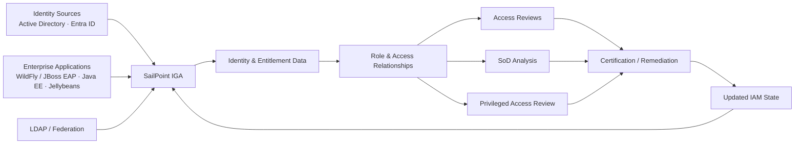

# Hello, I'm Dhruv, 

Identity Engineer delivering fixed-term IAM engagements across enterprise environments, with a career spanning enterprise IAM operations, identity governance, access control, and cloud identity migration. Specialises in Identity Governance and Administration, Microsoft Entra ID, SailPoint IGA, entitlement management, and access governance across hybrid enterprise environments. Brings practical experience delivering identity migration and assurance outcomes, including Azure RBAC, SoD analysis, and auditable identity controls aligned with ISM and NZISM requirements.

`NZISM` · `ISM` · `Essential Eight Maturity Level 3`   
 

Recent portfolio work [`IĀTŌ-v7`](https://github.com/whatheheckisthis/Intent-to-Auditable-Trust-Object-v7), the latest iteration of the [`IĀTŌ`](https://github.com/whatheheckisthis/Intent-to-Auditable-Trust-Object-Index). The work explores structured representation and validation of identity and access states across enterprise identity environments, with a focus on making access relationships and security properties auditable and machine-verifiable.

## Overview

| Attribute                            | Position                                                                                                                          |
| ------------------------------------ | --------------------------------------------------------------------------------------------------------------------------------- |
| **Practice**                         | Identity Engineering / Identity Governance & Administration                                                                       |
| **Engagement model**                 | Fixed-term IAM contractor                                                                                                         |
| **Delivery focus**                   | Identity governance, access control, entitlement management, authentication, and cloud identity migration                         |
| **Primary IAM platforms**            | SailPoint IGA · Microsoft Entra ID · Active Directory · Azure RBAC · Conditional Access                                           |
| **Enterprise identity environments** | Hybrid identity estates spanning modern cloud platforms, enterprise application platforms, and legacy authentication dependencies |
| **Application integration**          | Jellybeans · WildFly / JBoss EAP · Java EE · LDAP · federated authentication                                                      |
| **Integration**               | Legacy browser authentication plugins · JScript · ActiveX                                                                         |
| **IAM operations**                   | Access reviews · entitlement validation · privileged access · application onboarding · ServiceNow · BAU identity operations       |
| **Governance & assurance**           | SoD analysis · entitlement governance · migration assurance · auditable identity controls                                         |
| **Cloud migration**                  | Legacy IAM relationship analysis and access-control migration into Microsoft Azure                                                |
| **Framework alignment**              | NZISM · ISM, applied to relevant identity and access controls                                                                     |
| **Primary environments**             | Australian and New Zealand enterprise environments                                                                                |

## Certifications & Technical Foundation

*Industry certifications previously held across Azure security, cloud platform engineering, and enterprise systems administration, providing the technical foundation underpinning subsequent IAM, identity governance, and cloud identity migration engagements.*

| Certification | Title                                                  | Year | Status                | Relevant Foundation                                                                   |
| ------------- | ------------------------------------------------------ | ---: | --------------------- | ------------------------------------------------------------------------------------- |
| **AZ-500**    | Microsoft Certified: Azure Security Engineer Associate | 2022 | **Lapsed / Inactive** | Azure identity, access control, security administration, and platform security        |
| **AZ-204**    | Microsoft Certified: Azure Developer Associate         | 2020 | **Lapsed / Inactive** | Azure application development, platform integration, and cloud service implementation |
| **EX200**     | Red Hat Certified System Administrator                 | 2022 | **Lapsed / Inactive** | Enterprise Linux administration, systems operations, and platform support             |


## Framework Adherence

### NZISM — New Zealand Information Security Manual

NZISM is used as a security control reference where identity and access activities fall within New Zealand government or regulated enterprise environments.

The practice focuses on IAM-relevant requirements including identity governance, access control, authentication, privileged access, entitlement management, and assurance. Identity and access relationships are evaluated against defined control assertions, with applicable requirements cross-referenced to NZISM control identifiers.

### ISM — Australian Government Information Security Manual

ISM is used as a security control reference for Australian enterprise and government-aligned identity engagements.

Relevant requirements are applied to identity and access controls covering authentication, privileged access, entitlement governance, access management, and identity assurance. Control evidence is derived from the underlying IAM data and operational processes rather than maintained as a separate compliance activity.

### E8 ML3 — ASD Essential Eight Maturity Level 3

Highest mandatory Essential Eight maturity grade. ML3 is treated as the baseline floor for all AU government and regulated enterprise engagements — not a ceiling or aspirational target.

Control families covered across all eight strategies:

```text
Application control          — allowlist enforcement, scope coverage, exception governance
Patch applications           — patch currency SLA, automated detection, gap evidence
Configure MS Office macros   — macro signing, sandbox enforcement, user override controls
User application hardening   — browser plugin governance, JScript/ActiveX control surface
Restrict admin privileges    — PAM coverage, standing access elimination, JIT attestation
Patch operating systems      — OS patch currency, EOL enforcement, unsupported asset register
MFA                          — phishing-resistant MFA, privileged and unprivileged coverage
Regular backups              — RTO/RPO-bound, restoration tested, integrity-chained
```

| ML3 Control Area                       | IAM Practice / Enterprise Technology                                                              |
| -------------------------------------- | ------------------------------------------------------------------------------------------------- |
| **Restrict administrative privileges** | SailPoint IGA · Microsoft Entra ID · Active Directory · Azure RBAC · privileged access governance |
| **MFA**                                | Microsoft Entra ID · Conditional Access · federated authentication                                |
| **User application hardening**         | Legacy browser authentication dependencies · JScript · ActiveX · enterprise application access    |
| **Application control**                | SailPoint IGA entitlement management · application onboarding · access governance                 |
| **Access governance**                  | SailPoint IGA · access certification · entitlement validation · SoD analysis                      |
| **Enterprise application integration** | WildFly / JBoss EAP · Java EE · Jellybeans · LDAP                                                 |
| **Identity migration**                 | OCI → Azure identity and access migration · legacy IAM relationship analysis · Azure RBAC         |

### Example — IAM Access Governance Data Path


```mermaid
flowchart LR
    A[Identity Sources<br/>Active Directory · Entra ID]
    B[Enterprise Applications<br/>WildFly / JBoss EAP · Java EE · Jellybeans]
    C[LDAP / Federation]

    A --> D[SailPoint IGA]
    B --> D
    C --> D

    D --> E[Identity & Entitlement Data]
    E --> F[Role & Access Relationships]

    F --> G[Access Reviews]
    F --> H[SoD Analysis]
    F --> I[Privileged Access Review]

    G --> J[Certification / Remediation]
    H --> J
    I --> J

    J --> K[Updated IAM State]
    K --> D
```

### BAU operating flow

The operating flow reflects standard enterprise IAM practice: identity, account, entitlement, role, and application access data is sourced from authoritative identity stores and connected applications, consolidated within the IGA platform, and processed through established IAM workflows.

The resulting identity and access state supports recurring access certification, entitlement validation, SoD analysis, privileged access review, application onboarding, and remediation. Changes are validated and recorded through the normal IAM lifecycle, maintaining an accurate and reviewable access state across the enterprise environment.

### BAU operating flow

| Stage            | IAM Activity                                                                                                                    |
| ---------------- | ------------------------------------------------------------------------------------------------------------------------------- |
| **Collect**   | Identity, entitlement, and application access data is sourced from enterprise identity systems and connected applications.      |
| **Normalise** | SailPoint IGA maintains the identity, entitlement, role, and access relationships used for IAM operations and governance.       |
| **Analyse**   | Access relationships are evaluated through access reviews, entitlement validation, SoD analysis, and privileged-access reviews. |
| **Remediate** | Unauthorised, excessive, or conflicting access is removed, corrected, or recorded through established IAM workflows.            |
| **Certify**   | Approved access and completed remediation are recorded as part of the ongoing access-governance cycle.                          |
| **Maintain**  | The resulting IAM state supports subsequent reviews, application onboarding, entitlement governance, and migration activities.  |

The example reflects a standard enterprise IAM BAU operating model, where identity, account, entitlement, role, and application access data is collected from authoritative identity sources and integrated applications. The IGA layer consolidates these relationships to support access certification, entitlement validation, SoD analysis, and privileged-access governance, with approved changes and remediation actions propagated through established IAM workflows.

This operating model supports the ongoing IAM lifecycle across joiner, mover, and leaver processes, access reviews, entitlement governance, application onboarding, privileged-access administration, and identity migration, using the managed identity and access state as the primary operational data set.


> **Disclaimer:** Identity and access outcomes are derived from structured SailPoint IGA data, including identity, entitlement, role, and access relationship records. Extracted IAM data is normalised and evaluated against defined control assertions to produce auditable evidence and support automated validation. Control mappings are cross-referenced against existing requirements and control identifiers within ISM and NZISM; they do not represent newly defined compliance obligations.


## Enterprise Security Practice

The practice is grounded in enterprise IAM and security operations across Microsoft Entra ID, Active Directory, SailPoint IGA, Azure RBAC, Conditional Access, ServiceNow, Azure Policy, Microsoft Defender, and Microsoft Sentinel.

The focus is on delivering practical BAU and transformation outcomes across identity governance, access control, privileged access, entitlement management, migration assurance, and security compliance, while providing auditable evidence of control effectiveness.

---

## Delivery & Assurance Model

| Component               | Description                                                                                                                             |
| ----------------------- | --------------------------------------------------------------------------------------------------------------------------------------- |
| **Identity Data Model** | SailPoint IGA identity, entitlement, role, and access relationships                                                                     |
| **Control Model**       | Existing IAM and security controls represented as defined, testable assertions                                                          |
| **Evidence Model**      | Machine-verifiable evidence generated from underlying identity and access data                                                          |
| **Control Crosswalk**   | Existing ISM and NZISM requirements mapped to applicable IAM controls                                                                   |
| **Assurance Model**     | Reusable control evidence supporting governance, audit, and compliance activities                                                       |
| **Operating Model**     | Enterprise IAM BAU processes including access reviews, entitlement validation, privileged access, SoD analysis, and migration assurance |

>**Disclaimer:** Identity and access outcomes are derived from structured SailPoint IGA data, including identity, entitlement, role, and access relationship records. Extracted IAM data is normalised and evaluated against defined control assertions to produce auditable evidence and support automated validation. Control mappings are cross-referenced against existing requirements and control identifiers within ISM and NZISM; they do not represent newly defined compliance obligations.

`NZISM` · `ISM` · `Essential Eight Maturity Level 3`   

**Engagement enquiries:** Direct recruiter engagement preferred.

```text
itsdhruvsetty@gmail.com
```
